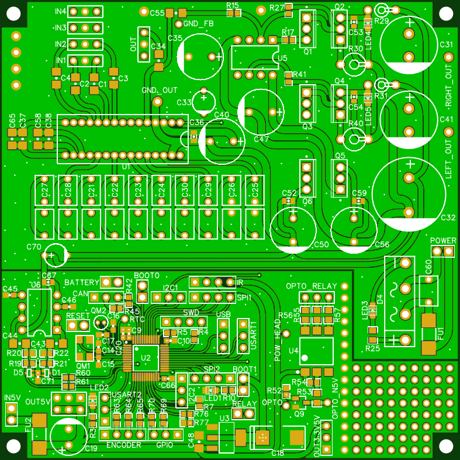
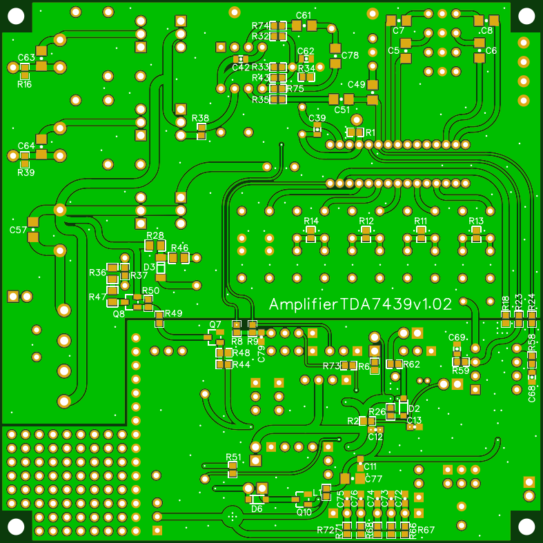
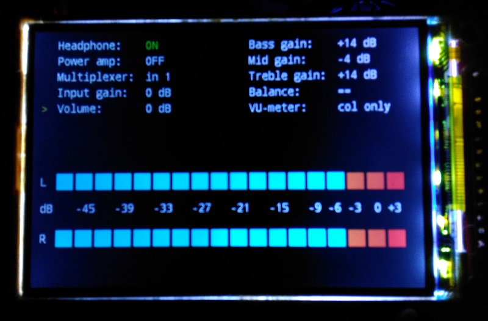

# AmplifierTDA7439

## Hi-Fi preamplifier based on audio processor TDA7439 and ARM microcontroller STM32F303CC ([Scheme](https://easyeda.com/Electrician/amplifiertda7439))

### Top side of the PCB

### Bottom side of the PCB

### Amplifier display

